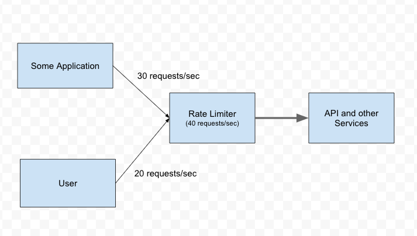
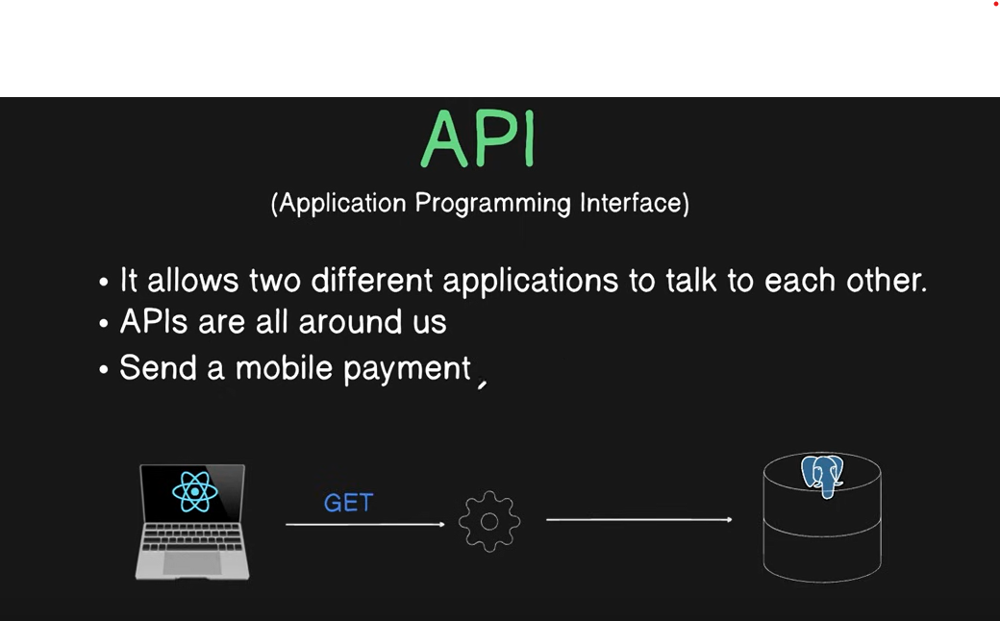

[Product-Store](img/product-store-app-homepage.png)

## Arcjet:
- Arcjet is used for the rate limiting and bot detection of the website.
- Link: [Arcjet](https://arcjet.com/)

### Bot Detection
- Bot detection is a technique to identify and block automated bots from accessing your website or application. 
- It works by analyzing the behavior of the bot and comparing it with known patterns of behavior. 
- If the behavior matches a known pattern, the bot is blocked from accessing the website or application.

### Rate Limiting
- Rate limiting is a technique to prevent an attacker from overwhelming a server with too many requests. 
- It works by limiting the number of requests that a client can make within a certain time period.


### API 
- An API (Application Programming Interface) is a set of protocols, routines, and tools for building software applications. 
- It defines how software components should interact with each other. 
- APIs are used to exchange data between different software applications and services.



### RESTful API
- A RESTful API is an API that follows the REST architectural style and allows clients to interact with the API using standard HTTP methods. 
- RESTful APIs are designed to be stateless and scalable, which makes them easier to use and manage.

### API Endpoints
- An API endpoint is a URL that represents a resource or a service on the server. 
- It is typically a unique URI that identifies a resource or service. 
- API endpoints are used to perform operations on the resources or services provided by the API.

### API Methods
- An API method is a type of request that can be performed on an API endpoint. 
- There are several HTTP methods that can be used to perform different operations on an API endpoint. 
- Some of the commonly used HTTP methods are:
  - GET: Used to retrieve data from the API endpoint.
  - POST: Used to create a new resource on the API endpoint.
  - PUT: Used to update an existing resource on the API endpoint.
  - DELETE: Used to delete a resource from the API endpoint.
  - PATCH: Used to partially update an existing resource on the API endpoint.

  * **Difference in put and patch:**
  - PUT: It replaces the entire resource with the new data.
  - PATCH: It updates only the specified fields of the resource with the new data.


### Technologies Used
- **`Express`**: A minimal and flexible Node.js web application framework that provides a robust set of features for web and mobile applications.

- **`dotenv`**: A module to load environment variables from a .env file into process.env. This helps in managing configuration settings and keeping sensitive information out of your source code.

- **`helmet`**: A middleware to help secure Express apps by setting various HTTP headers. It's effective in mitigating common web vulnerabilities.

- **`morgan`**: A middleware for HTTP request logging. It provides a way to log details about incoming requests to your application, which is useful for debugging and monitoring.

- **`cors`**: A middleware to enable Cross-Origin Resource Sharing (CORS). It allows your server to accept requests from different origins, which is crucial for client-server interactions in a web application.


#### *Remove the File from the Repository*
- If you've committed the `.env` file by mistake
- First, remove the `.env` file from the repository without deleting it from your local file system. You can do this by running the following command:
```
git rm --cached .env
```